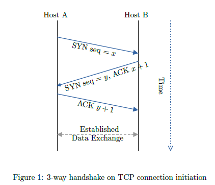
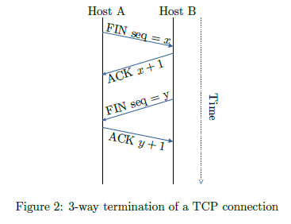
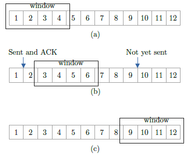
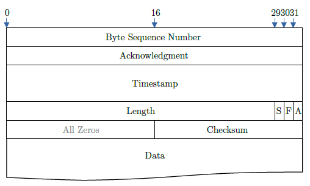

# TCP Over UDP

## Overview

We'll start out by giving a brief introduction to TCP in Section 1 before moving
onto the implementation. So, do not get scared if it seems very long at first. 

### Environment Setup

Requires mininet, pox, and xterm to be installed.

## 1. Background

### 1.1 Introduction

The Transmission Control Protocol (TCP) standard is defined in the Request For Comment (RFC) standards
document number 793 by the Internet Engineering Task Force (IETF). The original specification written in
1981 was based on earlier research and experimentation in the original ARPANET. The design of TCP was
heavily influenced by what has come to be known as the “end-to-end argument”.

As it applies to the Internet, the end-to-end argument says that by putting excessive intelligence in physical
and link layers to handle error control, encryption or flow control you unnecessarily complicate the system.
This is because these functions will usually need to be implemented at the endpoints anyways, so duplication
of this functionality in the intermediate points can be a waste. The result of an end-to-end network then, is
to provide minimal functionality on a hop-by-hop basis and maximal control between end- to-end commu-
nicating systems. The end-to-end argument helped determine the design of various components of TCP’s
reliability, flow control, and congestion control algorithms. The following are a few important characteristics
of TCP.

### 1.2 Byte Stream Delivery

TCP interfaces between the application layer above and the network layer below. When an application sends
data to TCP, it does so in 8-bit byte streams. It is then up to the sending TCP to segment or delineate
the byte stream in order to transmit data in manageable pieces to the receiver. It is this lack of record
boundaries which give it the name byte stream delivery service.

### 1.3 Connection-oriented Approach

Before two communicating TCP endpoints can exchange data, they must first agree upon the willingness to
communicate. Analogous to a telephone call, a connection must first be made before two parties exchange
information.


### 1.4 Reliability

A number of mechanisms help provide the reliability TCP guarantees. Each of these are described briefly
below.

- Checksums: All TCP segments carry a checksum, which is used by the receiver to detect errors with
    either the TCP header or data.
- Duplicate data detection: It is possible for packets to be duplicated in packet switched network;
    therefore TCP keeps track of bytes received in order to discard duplicate copies of data that has already
    been received.
- Retransmissions: In order to guarantee delivery of data, TCP must implement retransmission
    schemes for data that may be lost or damaged. The use of positive acknowledgements by the re-
    ceiver to the sender confirms successful reception of data. The lack of positive acknowledgements,
    coupled with a timeout period (see timers below) calls for a retransmission.
- Sequence numbers: In packet switched networks, it is possible for packets to be delivered out of
    order. It is TCP’s job to properly sequence segments it receives so it can deliver the byte stream data
    to an application in order.
- Timers: TCP maintains various static and dynamic timers on data sent. The sending TCP waits for
    the receiver to reply with an acknowledgement within a bounded length of time. If the timer expires
    before receiving an acknowledgement, the sender can retransmit the segment.

### 1.5 Connection Establishment and Termination

TCP provides a connection-oriented service over packet switched networks. Connection-oriented implies that
there is a virtual connection between two endpoints. There are three phases in any virtual connection. These
are the connection establishment, data transfer and connection termination phases.

### 1.6 3-way handshake

In order for two hosts to communicate using TCP they must first establish a connection by exchanging
messages in what is known as the three-way handshake. The diagram below depicts the process of the
three-way handshake. From Figure 1, it can be seen that there are three TCP segments exchanged between
two hosts, Host A and Host B. Reading down the diagram depicts events in time.

To start, Host A initiates the connection by sending a TCP segment with the SYN control bit set and an
initial sequence number (ISN) we represent as the variable x in the sequence number field.

At some moment later in time, Host B receives this SYN segment, processes it and responds with a TCP
segment of its own. The response from Host B contains the SYN control bit set and its own ISN represented
as variabley. Host B also sets the ACK control bit to indicate the next expected byte from Host A should
contain data starting with sequence numberx+ 1.

When Host A receives Host B’s ISN and ACK, it finishes the connection establishment phase by sending a
final acknowledgement segment to Host B. In this case, Host A sets the ACK control bit and indicates the
next expected byte from Host B by placing acknowledgement numbery+ 1 in the acknowledgement field.

In addition to the information shown in the diagram above, an exchange of source and destination ports to
use for this connection are also included in each senders’ segments.

### 1.7 Data Transfer

Once ISNs have been exchanged, communicating applications can transmit data between each other. Most of
the discussion surrounding data transfer requires us to look at flow control and congestion control techniques
which we discuss later in this document. A few key ideas will be briefly made here, while leaving the technical
details aside.



```
Figure 1: 3-way handshake on TCP connection initiation
```

A simple TCP implementation will place segments into the network for a receiver as long as there is data
to send and as long as the sender does not exceed the window advertised by the receiver. As the receiver
accepts and processes TCP segments, it sends back positive cumulative acknowledgements, indicating the
next expected byte in sequence. If data is duplicated or lost, a “hole” may exist in the byte stream. A
receiver will continue to acknowledge the most current contiguous byte it has accepted.

If data queued by the sender reaches a point where data sent will exceed the receiver’s advertised window
size, the sender must halt transmission and wait for further acknowledgements and an advertised window size
that is greater than zero before resuming.Timersare used to avoid deadlock and unresponsive connections.
Delayed transmissions are used to make more efficient use of network bandwidth by sending larger “chunks”
of data at once rather than in smaller individual pieces.

### 1.8 Connection Termination

In order for a connection to be terminated, four segments are required to completely close a connection.
Four segments are necessary due to the fact that TCP is a full-duplex protocol, meaning that each end must
shut down independently. The connection termination phase is shown below.


```
Figure 2: 3-way termination of a TCP connection
```

Notice that instead of SYN control bit fields, the connection termination phase uses the FIN control bit fields
to signal the close of a connection. To terminate the connection in our example, the application running
on Host A signals TCP to close the connection. This generates the first FIN segment from Host A to Host
B. When Host B receives the initial FIN segment, it immediately acknowledges the segment and notifies
its destination application of the termination request. Once the application on Host B also decides to shut
down the connection, it then sends its own FIN segment, which Host A will process and respond with an
acknowledgement.

### 1.9 Sliding Window and Flow Control

Flow control is a technique whose primary purpose is to properly match the transmission rate of sender to
that of the receiver and the network. It is important for the transmission to be at a high enough rate to
ensure good performance, but also to protect against overwhelming the network or receiving host.

TCP uses the window field, briefly described previously, as the primary means for flow control. During
the data transfer phase, the window field is used to adjust the rate of flow of the byte stream between
communicating TCPs. This figure below illustrates the concept of the sliding window.


```
Figure 3: In this simple example, there is a 4-byte sliding window. Moving from left to right, the window
“slides” as bytes in the stream are sent and acknowledged.
```

### 1.10 Congestion Control

TCP congestion control and Internet traffic management issues in general is an active area of research and
experimentation. This final section is a very brief summary of the standard congestion control algorithms
widely used in TCP implementations today.

#### 1.10.1 Slow Start

Slow Start, a requirement for TCP software implementations is a mechanism used by the sender to control
the transmission rate, otherwise known as sender-based flow control. This is accomplished through the return
rate of acknowledgements from the receiver. In other words, the rate of acknowledgements from the receiver
determines the rate at which the sender can transmit data.

Initially, the Slow Start algorithm sets the congestion window to one segment, which is the maximum segment
size (MSS) initialized by the receiver during the connection establishment phase. When acknowledgements


are returned by the receiver, the congestion window increases by one segment for each acknowledgement
returned. Thus, the sender can transmit the minimum of the congestion window and the advertised window
of the receiver, which is simply called the transmission window.

Slow Start is actually not very slow when the network is not congested and network response time is good.
For example, the first successful transmission and acknowledgement of a TCP segment increases the window
to two segments. After successful transmission of these two segments and acknowledgements completes, the
window is increased to four segments. Then eight segments, then sixteen segments and so on, doubling from
there on out up to the maximum window size advertised by the receiver or until congestion finally does
occur.

#### 1.10.2 Congestion Avoidance

During the initial data transfer phase of a TCP connection the Slow Start algorithm is used. However, there
may be a point during Slow Start that the network is forced to drop one or more packets due to overload
or congestion. If this happens, Congestion Avoidance is used to slow the transmission rate. However, Slow
Start is used in conjunction with Congestion Avoidance as the means to get the data transfer going again
so it doesn’t slow down and stay slow.

In the Congestion Avoidance algorithm retransmission timer expiring or the reception of duplicate ACKs
can implicitly signal the sender that a network congestion situation is occurring. The sender immediately
sets its transmission window to one half of the current window size (the minimum of the congestion window
and the receiver’s advertised window size), but to at least two segments. If congestion was indicated by a
timeout, the congestion window is reset to one segment, which automatically puts the sender into Slow Start
mode. If congestion was indicated by duplicate ACKs, the Fast Retransmit and Fast Recovery algorithms
are invoked (see below).

As data is received during Congestion Avoidance, the congestion window is increased. However, Slow Start
is only used up to the halfway point where congestion originally occurred. This halfway point was recorded
earlier as the new transmission window. After this halfway point, the congestion window is increased by
one segment for all segments in the transmission window that are acknowledged. This mechanism will force
the sender to more slowly grow its transmission rate, as it will approach the point where congestion had
previously been detected.

### 1.11 Fast Retransmit

When a duplicate ACK is received, the sender does not know if it is because a TCP segment was lost or
simply that a segment was delayed and received out of order at the receiver. If the receiver can reorder
segments, it should not be long before the receiver sends the latest expected acknowledgement. Typically
no more than one or two duplicate ACKs should be received when simple out of order conditions exist. If
however more than two duplicate ACKs are received by the sender, it is a strong indication that at least one
segment has been lost. The TCP sender will assume enough time has lapsed for all segments to be properly
re-ordered by the fact that the receiver had enough time to send three duplicate ACKs.

When three or more duplicate ACKs are received, the sender does not even wait for a retransmission timer
to expire before retransmitting the segment (as indicated by the position of the duplicate ACK in the byte
stream). This process is called the Fast Retransmit algorithm.


## 2. TCP Over UDP Implementation

I have implemented a Transmission Control Protocol (TCP) which should incorporate the following features on top of theunreliable UDP sockets:

- Reliability (with proper re-transmissions in the event of packet losses / corruption)
- Data Integrity (with checksums)
- Connection Management (SYN and FIN)
- Optimizations (fast retransmit on 3 or more duplicate ACKs)


### 2.1 Protocol Specification

#### 2.1.1 Message Format

All data are sent using UDP. It communicates all the transport layer information in the data
portion of a UDP packet. To support reliability, hosts will implement a variant of the Go-Back-N protocol.
The sender will tag each outgoing message with an increasing sequence number. The receiver will use the
sequence numbers to ensure that all messages have been received in the correct order. If a message is
received out of order it will be stored in the receiver’s buffer (but not delivered to an application) and an
acknowledgment corresponding to the last successful contiguous byte received will be retransmitted. The
sender will maintain an acknowledgment timeout based on the round trip time of the link between the end
hosts. If a duplicate acknowledgment is received or if the acknowledgment timeout expires the sender will
resend the unacknowledged segment destined for the receiver. A one’s complement checksum on the data part is used to enforce message integrity. See figure 4 for details.


```
Figure 4: Binary packet format
```


- **Byte Sequence Number** is incremented according to the bytes sent. It indicates the position of the
    first byte of the data in this segment.
- **Acknowledgment** indicates the next byte expected in the reverse direction
- **Timestamp** is derived from the System.nanoTime() function and is the time of data transmission (in
    nanoSeconds) which is 64 bits (or 8 bytes) long in size.
- **Length** is the length of the data portion (in bytes) and please pay attention that the least three
    significant bits are used by flags. That means valid number of bits for the length field are only 29 bits
    (You will need to do bit manipulation to access and set these fields).
- **Three flags:** S for SYN, A for ACK, and F for FIN.
- **Checksum** is the one’s complement checksum computed over the entire packet with the checksum
    assumed zero in the input. See appendix A on how to calculate one’s complement checksum.

#### 2.1.2 Maximum Number of Retransmissions

If unacknowledged messages remain in a host’s send buffer and no response from the destination has been
received after multiple retransmission attempts, the sending host will stop trying to send the messages and
report an error. This maximum is set to 16 by default.

#### 2.1.3 Maximum Transmission Unit

Maximum Transmission Unit (MTU) determines the maximum size of payload that can be transmitted in
one packet. So in order to transfer a huge file , it needs to be divided into smaller chunks the maximum size
of each chunk being MTU. It is passed as a command line argument to the client and server during startup.

#### 2.1.4 Connection State and Peer Actions

Suppose host A wants to send a message to host B. Assume, for now, that A has never sent a message to B
(as will be clear, it does not matter if A has rebooted or has sent a message a long time ago, etc.).

- **Data Send Actions:** A will send a data segment as governed by the size of the sliding congestion
    window. In this assignment, the congestion window is a configured parameter. A will include a
    monotonically increasing timestamp (See Section 2.2 on how to compute this timestamp) on the packet.
    If A thinks this is a new connection (because it has never communicated with B before, or because it
    has somehow lost the connection state to B), it will set the sequence number to 0. For each subsequent
    message, A will include a new timestamp on the packet and increment the sequence number by the
    number of bytes sent.
- **Receiver Actions**
    **Connection start and data transfer:** If this is the first time B is communicating with A and has
    just received a segment with sequence number equal to zero, it creates a new connection state for A. For
    each segment received, B will send an acknowledgment to A. The acknowledgment packet has sequence
    number corresponding to the next expected byte. If no data is sent along with the acknowledgment,
    the length of this segment will be zero. Note data packets cannot have zero length. B also copies
    the timestamp field from the data segment into the corresponding ACK segment. Thus, A can use
    this timestamp field in the acknowledgment to calculate the round trip time for segments (refer to
    our discussion in class on calculating round trip times). **Retransmissions:** For each packet sent, the
    sender must maintain a retransmission timer (the computation of the timer is described in the next
    section). Whenever a packet has not been ACKed before its retransmission timer goes off, it must
    be re-sent. There is a timer set for the re-transmissions as well — thus, if the re-transmission is not
    ACKed, the packet will be re-re-transmitted. Apart from timeout based retransmissions, the sender
    also uses three duplicate acknowledgments for the same sequence number as an indicator of loss and
    retransmits the corresponding lost segment. This is the “fast retransmit” approach.

### 2.2 Timeout Computation

The sender places the current time in the packet timestamp field of the message header. When a packet is
acknowledged by the receiving client it will copy the packet timestamp into the acknowledged timestamp
field. When the sender receives the acknowledgment it can subtract the acknowledgment timestamp from
the current time to calculate the round trip time. If a client is sending a cumulative acknowledgment of
several packets, the timestamp from the latest received packet which is causing this acknowledgment should
be copied into the reply. We will use a simple exponentially weighted average to compute the timeout.

Before sending the first packet, the timeout value is, arbitrarily, set to 5 seconds. Assume the sender has
just received an ack with sequence S and timestamp T. Let C be the current time at the sender andTObe
the timeout time.

```java
if (S = 0)
    ERTT := (C - T)
    EDEV := 0
    TO := 2*ERTT
else
    SRTT := (C - T)
    SDEV := |SRTT - ERTT|
    ERTT := a*ERTT + (1-a)*SRTT
    EDEV := b*EDEV + (1-b)*SDEV
    TO := ERTT + 4*EDEV
```

The value of a is set to 0.875 and b is 0.75.

Computing the sender timestamp: In the 64-bit timestamp field, the sender includes a monotonically 
increasing timestamp with granularity of one nanosecond. This is obtained from the System.nanoTime()
function.

### 2.3 Host Commands/Output Format

I have implemented a java executable called TCPend. It needs a sender and receiver connection to start
the file transfer. Command line arguments will indicate which host is the initiator of a TCP transfer. The
senderTCPendmust support the following options at startup:

```bash
java TCPend -p <port> -s <remote IP> -a <remote port> -f <file name> -m <mtu> -c <sws>
```

- port: port number at which the client will run
- remote IP: the IP address of the remote peer (i.e. receiver). With the -s flag your program should
    operate in sending mode.
- remote port: the port at which the remote receiver is running
- file name: the file to be sent
- mtu: maximum transmission unit in bytes
- sws: sliding window size in number of segments

The remote receiver uses the following set of arguments:

```bash
java TCPend -p <port> -m <mtu> -c <sws> -f <file name>
```

- port: port number at which the receiver will listen at
- file name: the path where the incoming file should be written
- mtu: maximum transmission unit in bytes
- sws: sliding window size in number of segments

### Host Output

Each host should output the information about each segment that it sends and receives in the following
format:

```
<snd/rcv> <time> <flag-list> <seq-number> <number of bytes> <ack number>
```

where flag list includes S for SYN, A for ACK, F for FIN and D for data. The following are valid output
lines for a connection initiator that sends 112 bytes of data:

```
snd 34.335 S - - - 0 0 0
rcv 34.8 S A - - 0 0 1
snd 34.81 - A - - 1 0 1
snd 35.5 - A - D 1 56 1
snd 35.6 - A - D 57 56 1
rcv 36.2 - A - - 1 0 113
snd 36.65 - - F - 113 0 1
rcv 37.2 - A F - 1 0 114
snd 37.3 - A - - 114 0 2
```

At the end of the transfer, i.e., once the connection has been closed you should print the following statistics:

- Amount of Data transferred/received
- Number of packets sent/received
- Number of out-of-sequence packets discarded
- Number of packets discarded due to incorrect checksum
- Number of retransmissions
- Number of duplicate acknowledgements

## 3. Testing

To test the implementation, use a mininet virtual topology but modify the router implementation to drop 
packets with a given probability. E.g., drop 5% of the IP packets received. Then you could try sending the 
file from one mininet host to another (use xterm
to open terminal windows on different mininet hosts) connected via the modified router and see if the file
gets transferred correctly.

To run it first start mininet using the following command:

```bash
sudo ./run_mininet.py topos/single_rt.topo -a
```

Then start pox:

```bash
./run_pox.sh
```

Then start your virtual router that you’ve modified that will drop 5

```bash
java -jar VirtualNetwork.jar -v r1 -r rtable.r1 -a arp_cache
```

Now open terminal windows on hosts h1 and h2 by typing xterm h1 h2 in mininet console. Navigate to
the directory where with your TCP implementation and send a file from h1 to h2. If your implementation
is correct, the file should be successfully transferred to h2 i.e., content should exactly match. In addition to
visual inspection of the received file, you may also use checksum utilities such as sha256 sum to verify that
the files are indeed identical.